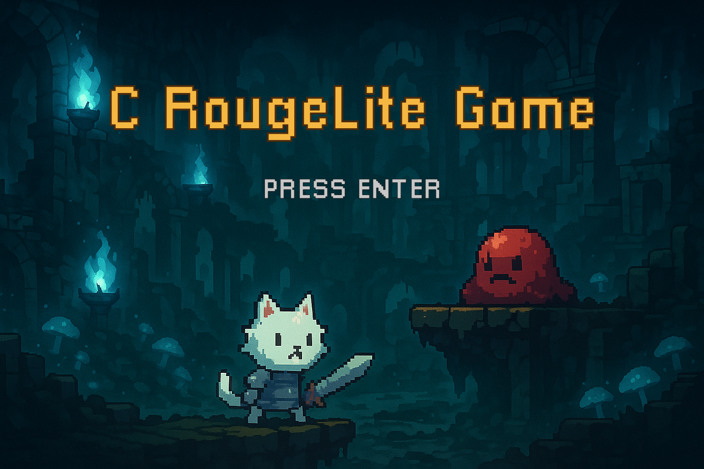
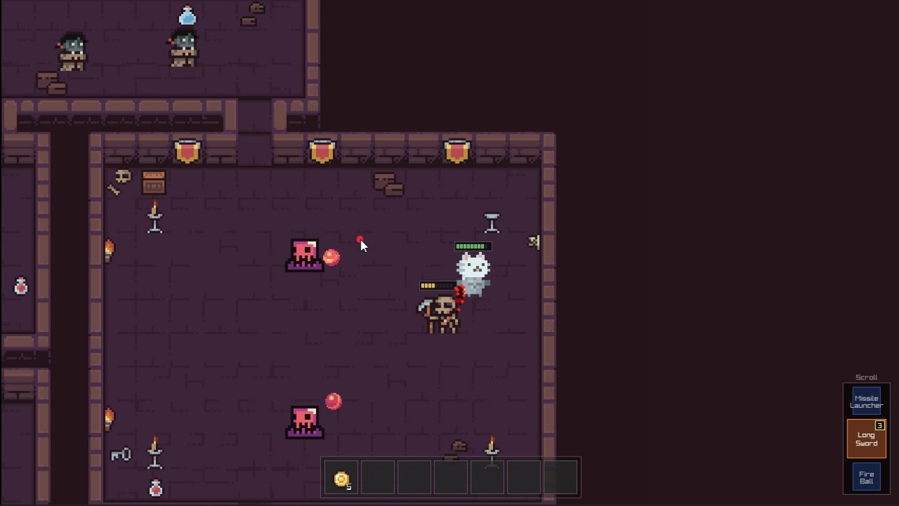
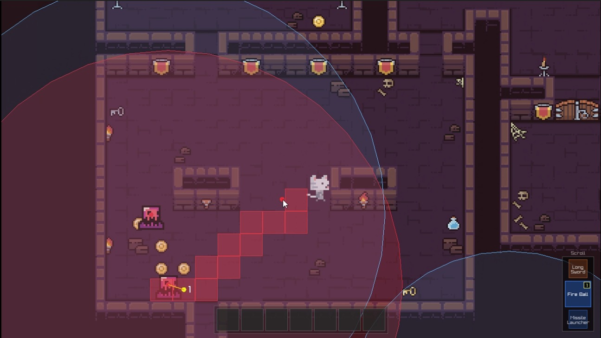

<p align="center"> 
   
  <br/>
  <b>
    Purr-fectly Perilous Adventures
  </b> 
  <br/>
</p>

---

##  Overview

**CRougeLite** is a 2D top-down shooter game where you play as a fancy cat knight who explores the dangerous dungeons and fights enemies to save the dungeon from the evil forces.

It was our way to learn C programming (hence the 'C' in the name) and game development in a pure way with out the help of any game engine or heavy dependence on external libraries. So all the systems except the rendering\* was handled by us, that includes (Physics, Assets, Animation, Input, etc.).

> [!note]
> \*The rendering is done using the amazing library [Raylib](https://www.raylib.com/)

> [!important]
> As our goal was to learn C and game dev, the code was our best attempt to write clean and readable code (at the time of development 😆), So feel free to give us your feedback and code review on both code quality and game design. You can be as harsh as you want, we are here to learn and improve. 😉

##  Screenshots

<p align="center"> 
   
  <br/>
  <b>
    Gameplay showing the player, enemies, health bar, inventory.
  </b> 
  <br/>
</p>

<p align="center"> 
   
  <br/>
  <b>
    Debug view showing the enemies ranges, enemies path calculated through A* algorithm, and the player position.
  </b> 
  <br/>
</p>

<p align="center"> 
   
  <br/>
  <b>
    Debug view showing the map colliders, and collectable items.
  </b> 
  <br/>
</p>

---

##  Gameplay

[](https://www.youtube.com/watch?v=XZyabeO-LcU)

<p align="center"> 
  <br/>
  <b>
    CLick the image to watch the gameplay demo.
  </b> 
  <br/>
</p>

---

##  Game Features

---

###  1. Character Controller

- Custom player controller that allows movement, dashes, shooting, and melee attacks.

---

###  2. Enemy AI + A\* Pathfinding

- Enemies has a range of sight in which they can see the player and chase them.
- They use A\* pathfinding algorithm to navigate through the map and reach the player.
- They can attack the player when they are close enough.

---

###  3. Physics System

- handles collisions of rigid bodies, ghost bodies, and other physics interactions.

> [!note]
> You can check the collision docs that we wrote here [Collision Docs](./docs/collision-system.md)

---

###  4. Inventory System and pickups

- Collectable items that can be picked up by the player.
- Player can have multiple items in their inventory.
- once used the item will be removed from the inventory.
- Players can press `F` to use the item in their inventory or interact with the environment.

---

###  5. Smart optimized asset management and loading

- Assets are kept to a minimum in one atlas image.
- Atlas is loaded once at the start and freed when the game is closed.


---

###  6. Animation System

- Implemented custom sprite animation system.
- Added an animation controller and animation state machines to allow for complex animation scenarios.

> [!note]
> You can check the animation docs that we wrote here [Animation Docs](./docs/animation-system.md)


---

###  7. Debug tools

- Our debug menu handles:
  - Showing and hiding textures
  - Showing and hiding texture bounds
  - Showing and hiding colliders (Hitboxes)
  - Showing A* pathfinding information
  - Show inventory
  - Enable and control music
  - Control zoom

---

###  8. Audio system (music and sound effects)

- Handles music and ambient
- Added sound effects with simple adaptive sound design
  - Most sound have random pitch shift to reduce restiveness.

---

###  9. Map System (map, colliders, loading, etc.)

- Map system that handles loading and unloading maps.
- Map colliders that are used to detect collisions with the player and enemies.

---

###  10. Map Editor (to create maps)

- A simple map editor to create maps.
- Allows you to place tiles, colliders, and items.
- Fully implemented in One html file with no dependencies.

---

##  Building and Running

- Run the command one time

```bash
cmake -S . -B build
```

- then to build the game run

```bash
cmake --build build
```

- to run

```bash
./build/CRougeLite/CRougeLite
```
---


## Small Dev Logs

> [!note]
> We made these early stage of the development.

- Debug menu

https://github.com/CmpGameDevs/CRougeLite/assets/88613195/7f33f56e-48b9-44d7-b6b7-c17bb6e8cf0c

- bullet mechanism animation system map drawing

https://github.com/CmpGameDevs/CRougeLite/assets/88613195/b4f882e9-f777-4ef8-86b4-f07be2bca59c

- Enemies

https://github.com/CmpGameDevs/CRougeLite/assets/88613195/0253e1f0-a1e2-4e23-a90d-dfadfa1daea3

- Animation

https://github.com/CmpGameDevs/CRougeLite/assets/88613195/f2cdf4f8-d7e9-420a-a4d2-33d8139cf26e

- Basic char movement and bullets

https://github.com/CmpGameDevs/CRougeLite/assets/88613195/fe7c7aa0-e9f0-41f7-b0aa-a6ca7fd24e12

---

##  Contributors

<table>
  <tr>
    <td align="center">
      <a href="https://github.com/marwan2232004"><br />
      <sub><b>Marwan Alhameedy</b></sub></a><br />
    </td>
    <td align="center">
      <a href="https://github.com/Mo2Hefny"><br />
      <sub><b>Moamen Hefny</b></sub></a><br />
    </td>
    <td align="center">
      <a href="https://github.com/YoussefMehany"><br />
      <sub><b>Youssef Mehany</b></sub></a><br />
    </td>
    <td align="center">
      <a href="https://github.com/amir-kedis"><br />
      <sub><b>Amir Kedis</b></sub></a><br />
    </td>
  </tr>
</table>

## 🔒 License 


This software is licensed under MIT License. See [License](LICENSE) for more information.