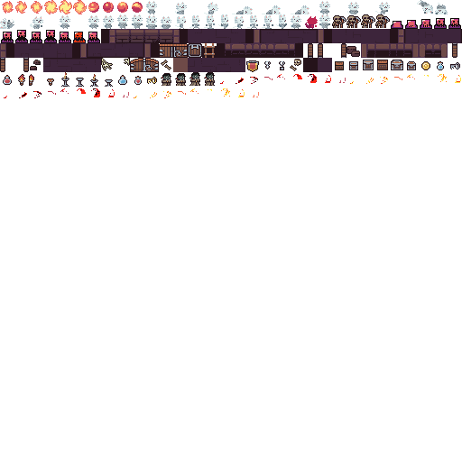
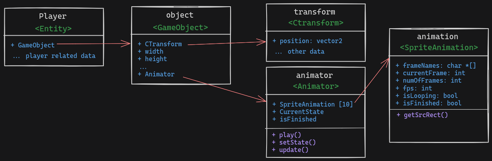

# Hola Amigos, in this small File I will show how to use animation system

> [!NOTE]
> note that this system is new
> so come here often to make sure nothing has changed in the api

## Table of centent

- Atlas - how we store textures
- Our Entity Component System Architecture for animation system
- API documentation
- How to use the animation system **SKIP to here if you are in a hurry**

## Atlas

- Atlas is a collection of textures



- to be efficient we store all textures in one big texture and draw the
  correct rectange from that texture to the screen.
- to make things convenient we map this texture through a file
  called `atlas.rtpa` that look like this:

```txt
# Sprite info:   s <nameId> <originX> <originY> <positionX> <positionY> <sourceWidth> <sourceHeight> <padding> <trimmed> <trimRecX> <trimRecY> <trimRecWidth> <trimRecHeight>
s Meow-Knight_Dodge_5_0 0 0 0 16 32 16 0 0 0 4 16 12
s Meow-Knight_Dodge_6_0 0 0 32 16 32 16 0 0 1 2 15 14
s Meow-Knight_Dodge_7_0 0 0 64 16 32 16 0 0 1 1 13 15
s Meow-Knight_Idle_0_0 0 0 96 16 16 16 0 0 1 1 13 15
s Meow-Knight_Idle_1_0 0 0 112 16 16 16 0 0 2 1 12 15
....
```

- when loading the resources we put in the game state the atlas and the mapping
- The api to get any file then from this texture become

```c
AtlasImage getAtlasImage(char *filename);
```

- atlas image contains all the information in the files which are all you need
  to draw a texture beside the texture it self which is stored in the atlas

> [!IMPORTANT]
> Important note
> whenever you can use the atlas and this api to get the texture you want
> because it is more efficient than loading the texture from the disk
> both in processing and mermory wise 😉

---

## Our Entity Component System Architecture for animation system



- The animation system mainly uses 1 old component and introduces 2 new components
- The old component is the `CTransform` component which is used to position the entity, and scale it
- The new components:
  - Animator: animation controller that controls the animation
  - SpriteAnimation: the animation itself and it's data

> [!CAUTION]
> Be careful
> The animation system expects the entity to have 2 components
> `CTransform` having correct position and scale values
> `Animator` to control the animation initiated with the animations used

---

## API documentation

### getSrcRect

- Get the source rectangle for the current frame of the animation/
- `param`: animator - The animator to get the source rectangle from.
- `return`: The source rectangle for the current frame of the animation.

```c
Rectangle getSrcRect(Animator *animator);
//---
Rectangle src = getSrcRect(animator);
```

### setState

- Set the state of the animator to the specified state.
- `param`: animator - The animator to set the state of.
- `param`: state - The state to set the animator to.

```c
void setState(Animator *animator, int state);
//---
setState(&(player->object.animator), DODGE);
```

### updateAnimator

- Update the animator to the next frame of the animation.
- `param`: animator - The animator to update.

```c
void updateAnimator(Animator *animator);
//---
updateAnimator(&(player->object.animator));
```

### drawAnimator

- Draw the animator to the screen.
- `param`: animator - The animator to draw.
- `param`: transform - The transform of the animator.
- `param`: tint - The tint color of the animator.
- `param`: flipX - Whether to flip the animator on the x-axis.

```c
void drawAnimator(Animator *animator, CTransform *transform, Color tint,
                  bool flipX);
//---
drawAnimator(&(players->object.animator), &(players->object.transform),
                 WHITE, flip);
```

---

## ✨ How to use the animation system ✨

- Now to understanding and using the system.
- the system is a sprite animation system
- which means that we change the frames so many times per second
- to give the illusion of movement
- navigating through the differenct is a state machine that is fully
- controled by the user of the system the system it self have no word
- in it, it just provides the fucntionsality.

- for using an animation we mainly do 3 steps and the 4th is optionaly
  1. load animation and define it
  2. change the state of the animation (optional)
  3. update the animation
  4. draw the animation

> [!NOTE]
> All animation data are stack allocated for robustness and speed
> so if something exeed the limit of the animation system
> increase the max in `defs.h`

- States are defines as following

```C
typedef enum
{
  IDLE,
  WALK,
  RUN,
  DODGE,
  ATTACK1,
  ATTACK2,
  TAKE_DAMAGE,
  DIE,
  // NOTE: add more as you wish here
} STATE;
```

- these are the animation that an entity can switch between
- note that their implementation will be different for each entity.
- and an entity can have one for them or all of them.

### Now for the fun the practical example

- let's lock at the player class as an example

1. we first init the animations of the player in `initPlayer()`

```C
player->object.animator = (Animator){
    .isFinished = false,
    .currentState = IDLE,
};

player->object.animator.animations[IDLE] = (SpriteAnimation){
    .frameNames = {"Meow-Knight_Idle_0_0", "Meow-Knight_Idle_1_0",
                   "Meow-Knight_Idle_2_0", "Meow-Knight_Idle_3_0",
                   "Meow-Knight_Idle_4_0", "Meow-Knight_Idle_5_0"},
    .numOfFrames = 6, // length of the above array
    .fps = 8,         // frames per second / speed of the animation
    .currentFrame = 0,// the current frame index of the animation
    .frameCount = 0,  // used for calculating the frame
    .isLooping = true,
    .isFinished = false,
};
player->object.animator.animations[RUN] = (SpriteAnimation){
  // same as above with different params for run animation
};
player->object.animator.animations[DODGE] = (SpriteAnimation){
  .isLooping = false,
  // ...
 };
```

2. Then we update the animation (step it)

```C
updateAnimator(&(player->object.animator));
```

3. Then we draw the animation

```C
drawAnimator(&(players->object.animator), &(players->object.transform),
                 WHITE, flip);
// NOTICE: that the draw uses the transform position and scale to determine
// the position and scale of the animation
// scaling is based on the source rectangle of the animation
```

4. (optional) we can change the state of the animation

- here I made the state machine in a simplestic form
- that I think are easir to reason about in the game dev world
- you define the state conditions (transition variables) in the input
  controller of the entity, the use these this values to early return and
  jump around.
- an example can make these clearer here is the animatationControlor of the player.

```C
static void animationControlor(Player *player) {
  if (IsKeyPressed(KEY_SPACE))
    setState(&(player->object.animator), DODGE);

  // NOTE: this meaning that looping animation have less priority than
  // non-looping animations like dodge and attack
  if (player->object.animator.isFinished == true) {
    if (player->isMoving) {
      setState(&(player->object.animator), RUN);
    } else {
      setState(&(player->object.animator), IDLE);
    }
  }
}
```

- and in the update function of the player we call this function

- And that's it, you have a fully functional animation system

---

# 🎉 Congratulations 🎉
